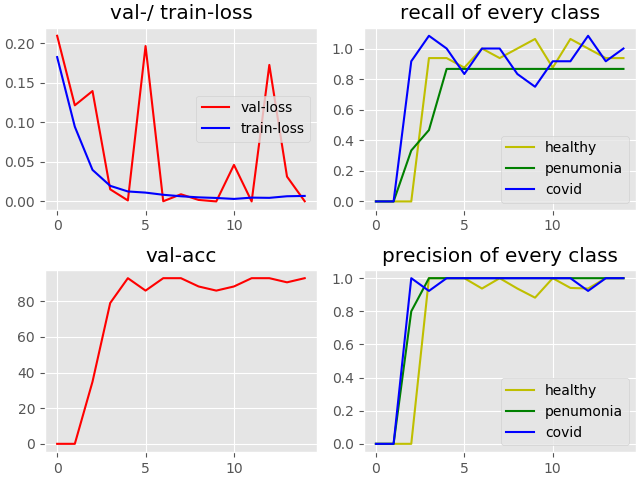

# Due to the small dataset (145 samples per class), the test results can not be considered accurate!

# | dataset:

### The dataset is assembled of [this](https://github.com/ieee8023/covid-chestxray-dataset) dataset for covid images (PA xray type only) and [this](https://github.com/ieee8023/covid-chestxray-dataset) dataset for healthy and other-type pneumonia images

### images (1, 512, 512):

##### (left healthy, right covid sample)

# | model:

## architecture:

# | training:

#### - epochs: 12
#### - batch-size: 16 (limited amount because of image size and GPU resources)
#### - learning-rate: 0.0001
#### - dropout (dense-layers): 40%

## trainings-progress:

## example outputs:

##### (correct classified: left healthy, right covid sample)

