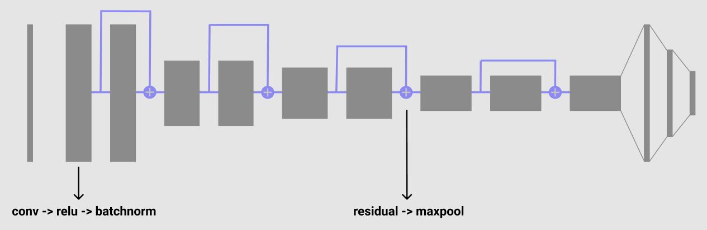
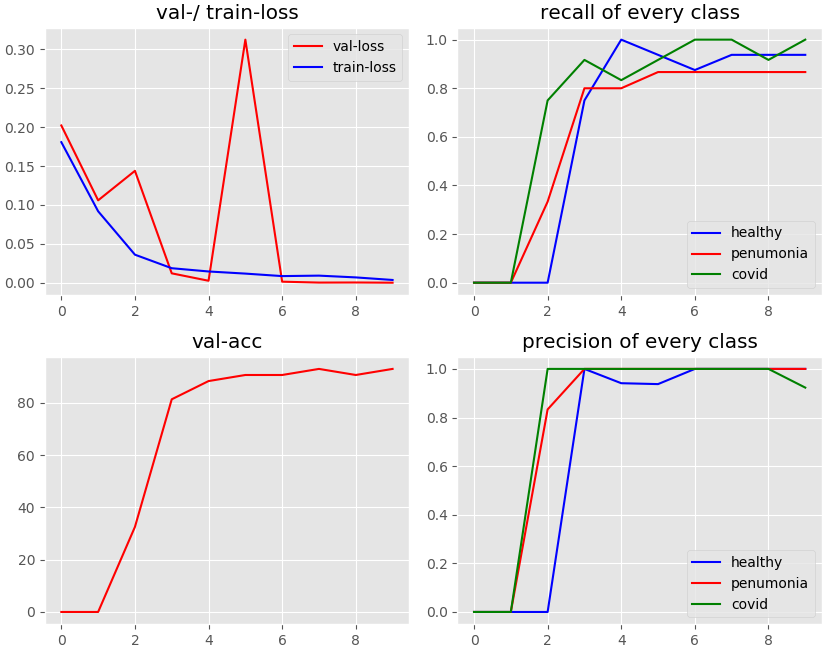
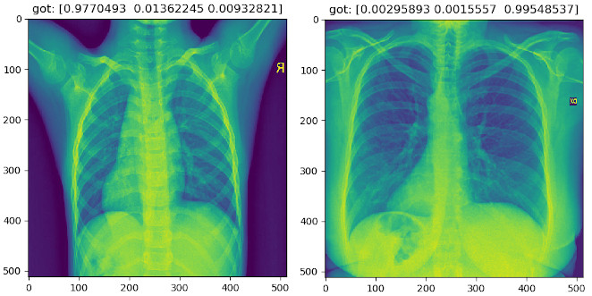
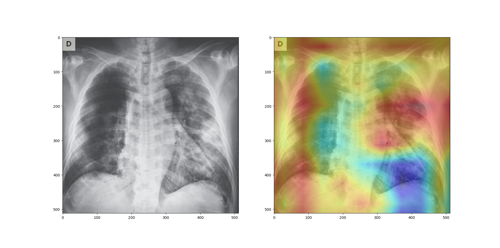

# Due to the small dataset (145 samples per class), the test results can not be considered accurate!


# | dataset:

### The dataset is assembled of [this](https://github.com/ieee8023/covid-chestxray-dataset) dataset for covid images (PA xray type only) and [this](https://github.com/ieee8023/covid-chestxray-dataset) dataset for healthy and other-type pneumonia images

### images (1, 512, 512):

##### (left healthy, right covid sample)

# | model:

## architecture:



# | training:

#### - epochs: 12
#### - batch-size: 16 (limited amount because of image size and GPU resources)
#### - learning-rate: 0.0001
#### - dropout (dense-layers): 40%

## trainings-progress:
### test-accuracy: 93.0233%
##### (high precision and recall, probably because of the small dataset)
### recalls:
#### covid: 100%, other-type pneumonia: 86.667%, healthy: 93.75%
### precisions:
#### covid: 100%, other-type pneumonia: 100%, healthy: 100%


## example outputs:

##### (correct classified: left healthy, right covid sample)


# | class-activation-heatmaps:
## the model is not compatible for creating class-maps, therefore a similiar, new one is needed. The last layers are:
### conv (512,9,9) -> global-average-pooling -> (512, 1) -> dense (512, 3)
### To create the class-activation-map, make the dot product of the weights, which are responsible for the output of a given class with the last cnv-feature-maps:

``` Python
weights = model.dense1.weight[class_idx]
weights = weights.cpu().detach().numpy()
feature_maps = feature_maps.cpu().detach().numpy().reshape(512, 9, 9)

cam = np.dot(feature_maps.T, weights)
cam = cam - np.min(cam)
cam = cam / np.max(cam)
```

### output for a covid-x-ray:

##### (Often, the cam result seem a bit random. Reasons could again be the small dataset or the other model-architecture)


